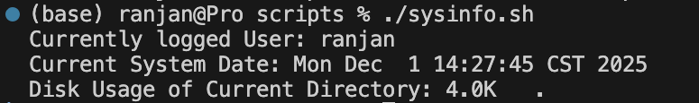
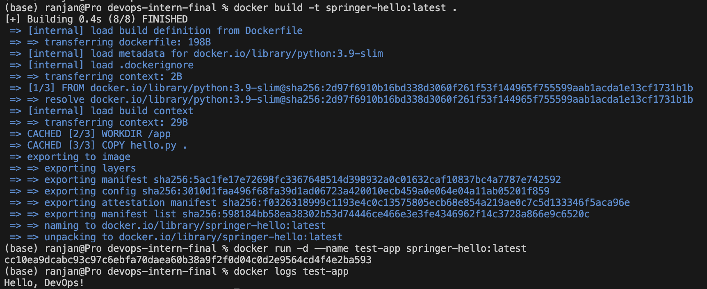

# DevOps Intern Final Assessment

**Name:** Ranjan Shrestha

**Date:** 1 December 2025

## Description

This repository demonstrates solutions for the DevOps Intern Final Assessment. It includes the following:

### Git and GitHub
- Initialized a GitHub repository named `devops-intern-final`.
- Added a `hello.py` script that outputs a "Hello, DevOps!" message.
- Created a `README.md` file documenting the project.

### Bash Scripting
- Developed a `sysinfo.sh` script inside the `scripts` folder to display:
    - current user
    - system date and time
    - disk usage of current directory
- The script can be run using following command:
    ```
    cd scripts
    ./sysinfo.sh
    ```


### Docker
- Wrote a `Dockerfile` to containerize the `hello.py` script.
- Successfully built and ran the Docker container. Below is the command to build and test the image locally:
    ```
    docker build -t springer-hello:latest .
    docker run -d --name test-app springer-hello:latest
    ```


### GitHub Actions
- Implemented a GitHub Actions workflow to automatically build new image for our python script and also push to Dockerhub in every push to the `main` branch. The pipeline builds and pushes two images one with `latest` tag and another with `github sha` tags.


### Nomad
- Created a Nomad job specification `hello.nomad` inside `nomad` folder to run a Docker container as a service.
    - Run the nomad agent
        ```
        nomad agent -dev
        ```
    - Run the job
        ```
        nomad job run nomad/hello.nomad
        ```
        

### Monitoring with Grafana Loki
- Set up log collection using alloy, log aggregation using loki and visualization with Grafana. The detailed steps are described in `loki_setup.md` under `monitoring` folder.