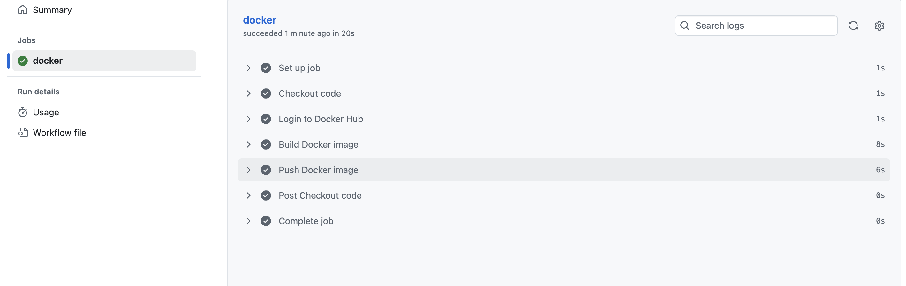
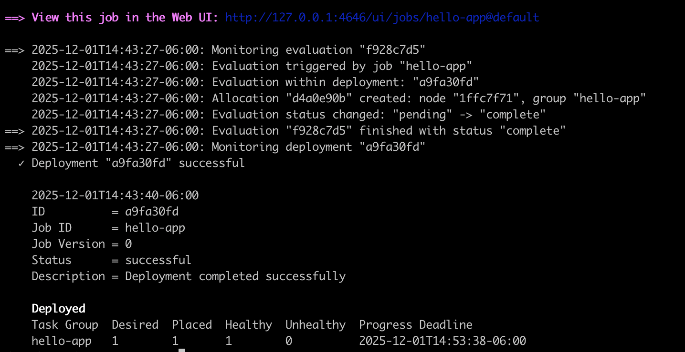

# DevOps Intern Final Assessment

**Name:** Ranjan Shrestha

**Date:** 19 November 2025

## Description

This repository demonstrates solutions for the DevOps Intern Final Assessment. It includes the following:

### Git and GitHub
- Initialized a GitHub repository named `devops-intern-final`.
- Added a `hello.py` script that outputs a "Hello DevOps" message.
- Created a `README.md` file documenting the project.

### Bash Scripting
- Developed a `sysinfo.sh` script inside the `scripts` folder to display system information.

### Docker
- Wrote a `Dockerfile` to containerize the `hello.py` script.
- Successfully built and ran the Docker container.

### GitHub Actions
- Implemented a GitHub Actions workflow to automatically build new image for our python script and also push to Dockerhub in every push to the `main` branch.


### Nomad
- Created a Nomad job specification `hello.nomad` inside `nomad` folder to run a Docker container as a service.
    - Run the nomad agent
        ```
        nomad agent -dev
        ```
    - Run the job
        ```
        nomad job run nomad/hello.nomad
        ```
        

### Monitoring with Grafana Loki
- Set up log collection using alloy, log aggregation using loki and visualization with Grafana. The detailed steps are described in `loki_setup.md` under `monitoring` folder.